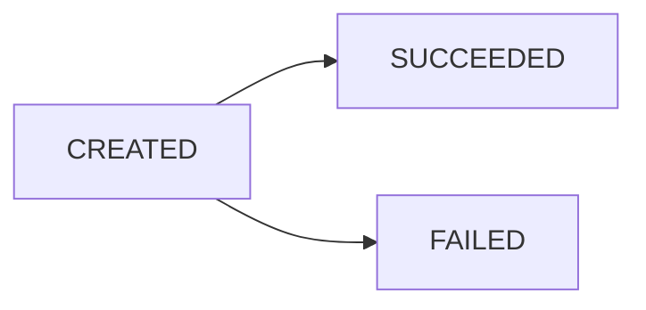

## Overview

Mangopay supports three fundamental types of money movement:

<CardGroup cols={3}>
  <Card title="Pay-In" icon="arrow-down" color="#10b981">
    Bring funds into a wallet from external sources
  </Card>
  <Card title="Transfer" icon="arrow-right-arrow-left" color="#f59e0b">
    Move funds between wallets internally
  </Card>
  <Card title="Pay-Out" icon="arrow-up" color="#ef4444">
    Send funds from a wallet to a bank account
  </Card>
</CardGroup>

## Pay-Ins

Pay-ins bring money into the Mangopay platform from external payment sources.

### Payment Types

Mangopay supports multiple payment types:

- **CARD** - Credit/debit card payments
- **BANK_WIRE** - Bank wire transfers
- **DIRECT_DEBIT** - Direct debit payments
- **PAYPAL** - PayPal payments
- **APPLE_PAY** - Apple Pay
- **GOOGLE_PAY** - Google Pay
- **PAYCONIQ** - Payconiq by Bancontact
- **MBWAY** - MB WAY
- **MULTIBANCO** - Multibanco
- **SATISPAY** - Satispay
- **BLIK** - BLIK
- **KLARNA** - Klarna
- **IDEAL** - iDEAL
- **GIROPAY** - Giropay
- **BANCONTACT** - Bancontact
- **BIZUM** - Bizum
- **SWISH** - Swish
- **TWINT** - TWINT

Reference: ~/workspace/source/MangoPay/PayIn.php:20

### Execution Types

Pay-ins can be executed in different ways:

- **WEB** - User is redirected to complete payment
- **DIRECT** - Direct payment (for registered cards)
- **EXTERNAL_INSTRUCTION** - Payment initiated outside Mangopay

Reference: ~/workspace/source/MangoPay/PayIn.php:32

### Card Pay-In (Web)

A common flow for collecting card payments:

```php
use MangoPay\PayIn;
use MangoPay\Money;
use MangoPay\PayInExecutionDetailsWeb;
use MangoPay\PayInPaymentDetailsCard;

$payIn = new PayIn();
$payIn->AuthorId = $userId;
$payIn->CreditedUserId = $userId;
$payIn->CreditedWalletId = $walletId;

// Debited funds (amount charged to user)
$payIn->DebitedFunds = new Money();
$payIn->DebitedFunds->Currency = "EUR";
$payIn->DebitedFunds->Amount = 10000; // €100.00 in cents

// Fees (your platform's commission)
$payIn->Fees = new Money();
$payIn->Fees->Currency = "EUR";
$payIn->Fees->Amount = 100; // €1.00 in cents

// Payment details
$payIn->PaymentType = "CARD";
$payIn->PaymentDetails = new PayInPaymentDetailsCard();
$payIn->PaymentDetails->CardType = "CB_VISA_MASTERCARD";

// Execution details
$payIn->ExecutionType = "WEB";
$payIn->ExecutionDetails = new PayInExecutionDetailsWeb();
$payIn->ExecutionDetails->ReturnURL = "https://yoursite.com/payment/return";
$payIn->ExecutionDetails->Culture = "EN";

$createdPayIn = $api->PayIns->Create($payIn);

// Redirect user to complete payment
header("Location: " . $createdPayIn->ExecutionDetails->RedirectURL);
```

### Bank Wire Pay-In

Allow users to fund their wallet via bank transfer:

```php
use MangoPay\PayIn;
use MangoPay\PayInPaymentDetailsBankWire;
use MangoPay\PayInExecutionDetailsDirect;

$payIn = new PayIn();
$payIn->AuthorId = $userId;
$payIn->CreditedWalletId = $walletId;
$payIn->PaymentType = "BANK_WIRE";
$payIn->ExecutionType = "DIRECT";

$payIn->DeclaredDebitedFunds = new Money();
$payIn->DeclaredDebitedFunds->Currency = "EUR";
$payIn->DeclaredDebitedFunds->Amount = 100000; // €1,000.00

$payIn->DeclaredFees = new Money();
$payIn->DeclaredFees->Currency = "EUR";
$payIn->DeclaredFees->Amount = 0;

$payIn->PaymentDetails = new PayInPaymentDetailsBankWire();
$payIn->ExecutionDetails = new PayInExecutionDetailsDirect();

$createdPayIn = $api->PayIns->Create($payIn);

// Display bank wire instructions to user
echo "Wire reference: " . $createdPayIn->WireReference;
echo "Bank account IBAN: " . $createdPayIn->PaymentDetails->BankAccount->IBAN;
echo "Bank account BIC: " . $createdPayIn->PaymentDetails->BankAccount->BIC;
```

### PayPal Pay-In

```php
use MangoPay\PayIn;
use MangoPay\PayInPaymentDetailsPaypal;
use MangoPay\PayInExecutionDetailsWeb;
use MangoPay\LineItem;

$payIn = new PayIn();
$payIn->AuthorId = $userId;
$payIn->CreditedWalletId = $walletId;
$payIn->PaymentType = "PAYPAL";
$payIn->ExecutionType = "WEB";

$payIn->DebitedFunds = new Money();
$payIn->DebitedFunds->Currency = "EUR";
$payIn->DebitedFunds->Amount = 5000; // €50.00

$payIn->Fees = new Money();
$payIn->Fees->Currency = "EUR";
$payIn->Fees->Amount = 500; // €5.00

$payIn->PaymentDetails = new PayInPaymentDetailsPaypal();
$payIn->PaymentDetails->ShippingPreference = "SET_PROVIDED_ADDRESS";

$payIn->ExecutionDetails = new PayInExecutionDetailsWeb();
$payIn->ExecutionDetails->ReturnURL = "https://yoursite.com/paypal/return";
$payIn->ExecutionDetails->Culture = "EN";

$createdPayIn = $api->PayIns->Create($payIn);

// Redirect to PayPal
header("Location: " . $createdPayIn->ExecutionDetails->RedirectURL);
```

### Check Pay-In Status

```php
$payIn = $api->PayIns->Get($payInId);

switch ($payIn->Status) {
    case 'SUCCEEDED':
        echo "Payment successful!";
        echo "Amount credited: " . $payIn->CreditedFunds->Amount;
        break;
    case 'FAILED':
        echo "Payment failed: " . $payIn->ResultMessage;
        echo "Error code: " . $payIn->ResultCode;
        break;
    case 'CREATED':
        echo "Payment pending";
        break;
}
```

Reference: ~/workspace/source/MangoPay/Transaction.php:45

## Transfers

Transfers move funds between wallets within the Mangopay platform.

```php
use MangoPay\Transfer;
use MangoPay\Money;

$transfer = new Transfer();
$transfer->AuthorId = $authorUserId;
$transfer->DebitedWalletId = $sourceWalletId;
$transfer->CreditedWalletId = $destinationWalletId;
$transfer->CreditedUserId = $destinationUserId;

// Amount to transfer
$transfer->DebitedFunds = new Money();
$transfer->DebitedFunds->Currency = "EUR";
$transfer->DebitedFunds->Amount = 5000; // €50.00

// Fees (your platform commission)
$transfer->Fees = new Money();
$transfer->Fees->Currency = "EUR";
$transfer->Fees->Amount = 500; // €5.00

$transfer->Tag = "Order #12345";

$createdTransfer = $api->Transfers->Create($transfer);

if ($createdTransfer->Status === 'SUCCEEDED') {
    echo "Transfer successful!";
    echo "Debited: " . $createdTransfer->DebitedFunds->Amount;
    echo "Credited: " . $createdTransfer->CreditedFunds->Amount;
    echo "Fees: " . $createdTransfer->Fees->Amount;
}
```

Reference: ~/workspace/source/MangoPay/Transfer.php:8

### Transfer with SCA

For transfers requiring Strong Customer Authentication:

```php
$transfer->ScaContext = "USER_PRESENT";

try {
    $createdTransfer = $api->Transfers->Create($transfer);
} catch (\MangoPay\Libraries\ResponseException $e) {
    if ($e->GetErrorCode() == 401) {
        $errorDetails = $e->GetErrorDetails();
        if (isset($errorDetails->Data['RedirectUrl'])) {
            // Redirect user for SCA
            $redirectUrl = $errorDetails->Data['RedirectUrl'];
        }
    }
}
```

Reference: ~/workspace/source/MangoPay/Transfer.php:25

## Pay-Outs

Pay-outs send funds from a wallet to an external bank account.

```php
use MangoPay\PayOut;
use MangoPay\Money;
use MangoPay\PayOutPaymentDetailsBankWire;

$payOut = new PayOut();
$payOut->AuthorId = $userId;
$payOut->DebitedWalletId = $walletId;
$payOut->DebitedFunds = new Money();
$payOut->DebitedFunds->Currency = "EUR";
$payOut->DebitedFunds->Amount = 10000; // €100.00

$payOut->Fees = new Money();
$payOut->Fees->Currency = "EUR";
$payOut->Fees->Amount = 0; // No fees

$payOut->PaymentType = "BANK_WIRE";
$payOut->MeanOfPaymentDetails = new PayOutPaymentDetailsBankWire();
$payOut->MeanOfPaymentDetails->BankAccountId = $bankAccountId;
$payOut->BankWireRef = "Payout to user";

$createdPayOut = $api->PayOuts->Create($payOut);

if ($createdPayOut->Status === 'SUCCEEDED') {
    echo "Payout successful!";
} else if ($createdPayOut->Status === 'CREATED') {
    echo "Payout is being processed";
}
```

Reference: ~/workspace/source/MangoPay/PayOut.php:8

<Warning>
Before creating a pay-out, ensure the user has a verified bank account. Pay-outs can only be made to bank accounts that belong to the wallet owner.
</Warning>

## Transaction Status Flow

All transactions (pay-ins, transfers, pay-outs) follow a status flow:



- **CREATED** - Transaction created but not yet processed
- **SUCCEEDED** - Transaction completed successfully
- **FAILED** - Transaction failed

Reference: ~/workspace/source/MangoPay/Transaction.php:45

## Money and Fees

### Understanding the Money Flow

Every transaction has three key amounts:

1. **DebitedFunds** - Amount taken from the source
2. **Fees** - Your platform's commission
3. **CreditedFunds** - Amount received at destination

<Info>
Formula: `CreditedFunds = DebitedFunds - Fees`
</Info>

```php
// Example: €100 transaction with €2 fee
$transaction->DebitedFunds->Amount = 10000;  // €100.00
$transaction->Fees->Amount = 200;            // €2.00
// CreditedFunds will be 9800 (€98.00)
```

Reference: ~/workspace/source/MangoPay/Transaction.php:27

### Zero Fees

You can set fees to zero if you don't want to charge a commission:

```php
$transfer->Fees = new Money();
$transfer->Fees->Currency = "EUR";
$transfer->Fees->Amount = 0;
```

## Error Handling

Always handle transaction errors:

```php
use MangoPay\Libraries\ResponseException;

try {
    $payIn = $api->PayIns->Create($payIn);
    
    if ($payIn->Status === 'FAILED') {
        // Handle failed transaction
        echo "Transaction failed: " . $payIn->ResultMessage;
        echo "Error code: " . $payIn->ResultCode;
    }
} catch (ResponseException $e) {
    // Handle API error
    echo "API Error: " . $e->getMessage();
    echo "Error code: " . $e->GetErrorCode();
    
    $errorDetails = $e->GetErrorDetails();
    if ($errorDetails) {
        echo "Details: " . $errorDetails->Message;
    }
}
```

## Common Payment Scenarios

### Marketplace Payment Flow

```php
// 1. Buyer pays into platform wallet
$payIn = createCardPayIn($buyerId, $platformWalletId, 10000, 0);

// 2. After order completion, transfer to seller (with commission)
$transfer = new Transfer();
$transfer->DebitedWalletId = $platformWalletId;
$transfer->CreditedWalletId = $sellerWalletId;
$transfer->DebitedFunds->Amount = 10000; // €100
$transfer->Fees->Amount = 1000;          // €10 commission
// Seller receives €90

// 3. Seller withdraws to bank account
$payOut = createBankWirePayOut($sellerId, $sellerWalletId, 9000);
```

### Crowdfunding Platform

```php
// Contributor pays in
$contributionPayIn = createPayIn($contributorId, $campaignWalletId, 5000, 250);

// Campaign succeeds - transfer to project owner
$transfer = new Transfer();
$transfer->DebitedWalletId = $campaignWalletId;
$transfer->CreditedWalletId = $projectOwnerWalletId;
$transfer->DebitedFunds->Amount = 4750; // After fees
$transfer->Fees->Amount = 0;

// Campaign fails - refund contributors
$refund = $api->PayIns->CreateRefund($payInId);
```

### Subscription Service

```php
// Monthly subscription charge
$payIn = createCardPayIn($userId, $serviceWalletId, 999, 0); // €9.99

// Affiliate commission payout
$transfer = new Transfer();
$transfer->DebitedWalletId = $serviceWalletId;
$transfer->CreditedWalletId = $affiliateWalletId;
$transfer->DebitedFunds->Amount = 300; // 30% commission
$transfer->Fees->Amount = 0;
```

## Best Practices

<AccordionGroup>
  <Accordion title="Always use idempotency keys">
    Use idempotency keys for all create operations to prevent duplicate transactions if requests are retried.
  </Accordion>
  
  <Accordion title="Store transaction IDs">
    Keep a record of all Mangopay transaction IDs in your database for auditing and reconciliation.
  </Accordion>
  
  <Accordion title="Handle all status states">
    Always check transaction status and handle CREATED, SUCCEEDED, and FAILED states appropriately.
  </Accordion>
  
  <Accordion title="Validate before transactions">
    Check wallet balances before transfers and pay-outs to provide better user experience.
  </Accordion>
  
  <Accordion title="Use webhooks for notifications">
    Implement webhooks to receive real-time updates about transaction status changes.
  </Accordion>
  
  <Accordion title="Set meaningful tags">
    Use the Tag property to associate transactions with your internal references (order IDs, etc.).
  </Accordion>
</AccordionGroup>

## Next Steps

<CardGroup cols={2}>
  <Card title="Error Handling" icon="triangle-exclamation" href="/concepts/error-handling">
    Learn how to handle errors gracefully
  </Card>
  <Card title="Wallets" icon="wallet" href="/concepts/wallets">
    Deep dive into wallet management
  </Card>
</CardGroup>